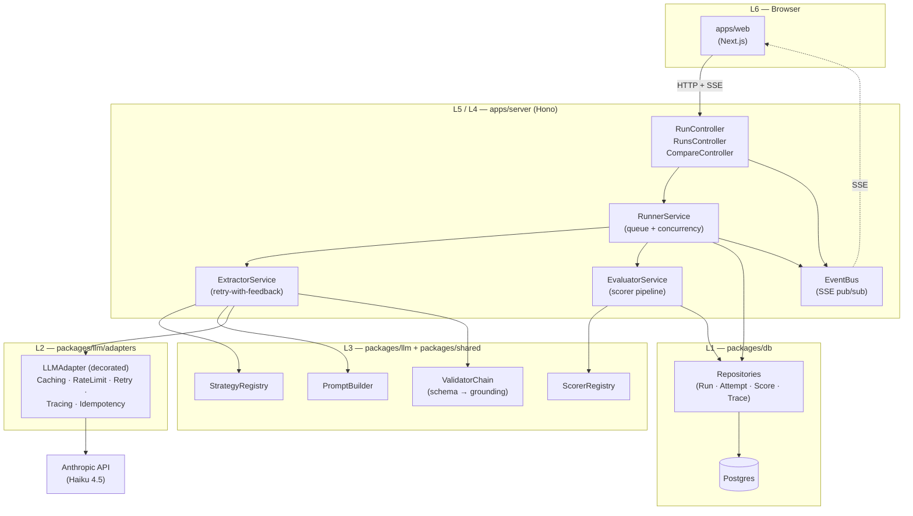
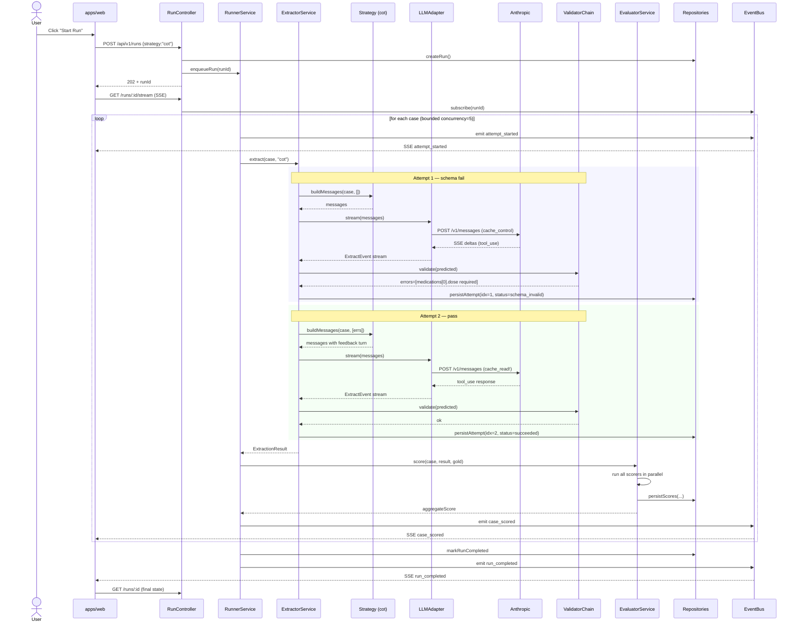
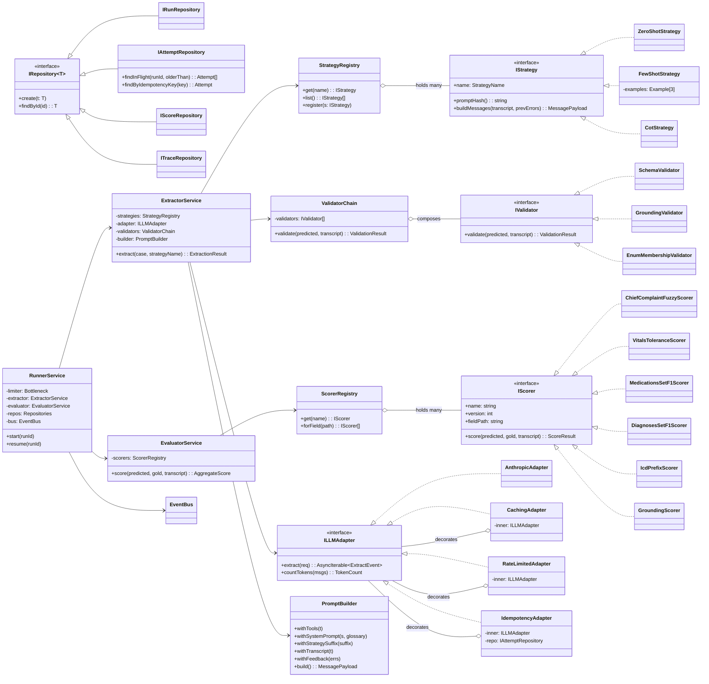

# Low-Level Design — HEALOSBENCH Eval Harness

> System design + design patterns + UML for the production-grade harness.
> Companion docs: [idea.md](idea.md ) (research) · [approach.md](approach.md) (build plan).

---

## Table of Contents

1. [System Architecture Overview](#1-system-architecture-overview)
2. [Identified Design Patterns](#2-identified-design-patterns)
3. [UML — Component Diagram](#3-uml--component-diagram)
4. [UML — Sequence Diagram (single transcript)](#4-uml--sequence-diagram-single-transcript)
5. [UML — Class Diagram](#5-uml--class-diagram)
6. [Extension Surfaces](#6-extension-surfaces)

---

## 1. System Architecture Overview

### 1.1 Layered architecture

The system has six logical layers, each with one job, communicating through narrow contracts.

```
  ┌──────────────────────────────────────────────────────────────────────┐
  │  L6  Presentation        Next.js dashboard                           │
  │                          • Runs list / Run detail / Compare view     │
  │                          Pure client; talks only to L5 over HTTP+SSE │
  ├──────────────────────────────────────────────────────────────────────┤
  │  L5  API / Edge          Hono on :8787                               │
  │                          • REST routes  • SSE pub  • Auth boundary   │
  │                          API key never crosses to L6                 │
  ├──────────────────────────────────────────────────────────────────────┤
  │  L4  Orchestration       Runner Service                              │
  │                          • Job queue · concurrency · rate-limit      │
  │                          • Resume scanner · idempotency · SSE pub    │
  ├──────────────────────────────────────────────────────────────────────┤
  │  L3  Domain              Strategy · Validator · Scorer · Trace       │
  │                          • Pure functions where possible             │
  │                          • Pluggable: strategies, scorers, models    │
  ├──────────────────────────────────────────────────────────────────────┤
  │  L2  Infrastructure      LLM Adapter · Cache mgmt · Prompt hashing   │
  │                          • Wraps Anthropic SDK                       │
  │                          • Provider-swappable                        │
  ├──────────────────────────────────────────────────────────────────────┤
  │  L1  Storage             Postgres + Drizzle                          │
  │                          • runs · attempts · scores · traces         │
  │                          • Repository interfaces                     │
  └──────────────────────────────────────────────────────────────────────┘
```

### 1.2 High-level component map

```
                                         ┌──────────────────┐
                                         │   apps/web       │
                                         │   (Next.js)      │
                                         └────────┬─────────┘
                                                  │ HTTP + SSE
                                                  ▼
   ┌──────────────────────────────────────────────────────────────────┐
   │                       apps/server (Hono)                          │
   │                                                                   │
   │  ┌─────────────────┐    ┌─────────────────┐   ┌──────────────┐  │
   │  │  RunController  │───▶│  RunnerService  │──▶│  EventBus    │  │
   │  └─────────────────┘    └────┬────────────┘   │  (SSE pub)   │  │
   │                              │                └──────────────┘  │
   │                              ▼                                  │
   │  ┌─────────────────────────────────────────────────────────┐   │
   │  │              ExtractorService (per case)                 │   │
   │  │                                                          │   │
   │  │  Strategy ─▶ PromptBuilder ─▶ LLMAdapter ─▶ Validator  │   │
   │  │      ▲                            │             │       │   │
   │  │      │ retry-with-feedback        │             │       │   │
   │  │      └──── ValidationFeedback ◀───┴─────────────┘       │   │
   │  └────────────────────┬─────────────────────────────────────┘   │
   │                       ▼                                          │
   │  ┌─────────────────────────────────────────────────────────┐   │
   │  │               EvaluatorService (per case)                │   │
   │  │                                                          │   │
   │  │  Scorer₁ ─▶ Scorer₂ ─▶ ... ─▶ Scorerₙ ─▶ AggregateScore │   │
   │  └────────────────────┬─────────────────────────────────────┘   │
   │                       ▼                                          │
   │  ┌─────────────────────────────────────────────────────────┐   │
   │  │             Repositories (Drizzle / Postgres)            │   │
   │  │   RunRepo · AttemptRepo · ScoreRepo · TraceRepo          │   │
   │  └────────────────────┬─────────────────────────────────────┘   │
   └──────────────────────┼─────────────────────────────────────────┘
                          ▼
                 ┌──────────────────┐               ┌────────────────┐
                 │   Postgres DB    │               │  Anthropic API │
                 │  (canonical SoT) │               │  (Haiku 4.5)   │
                 └──────────────────┘               └────────────────┘
```

### 1.3 The data lifecycle for one transcript

```
  case_id
     │
     ▼  Runner picks from queue (bounded concurrency)
     │
     ▼  Strategy builds messages → PromptBuilder assembles cache_control
     │
     ▼  LLMAdapter calls Anthropic (streaming SSE)
     │
     ▼  Tool-use response → Validator chain (schema → grounding)
     │       │
     │       ├─ pass ──▶ continue
     │       └─ fail ──▶ ValidationFeedback → retry (≤3) ──┐
     │                                                       │
     │   ◀───────────────────────────────────────────────────┘
     ▼
     ▼  EvaluatorService runs scorers
     │
     ▼  Repositories persist (attempt + scores + trace)
     │
     ▼  EventBus publishes SSE event → dashboard updates
```

---

## 2. Identified Design Patterns

Eight patterns emerge naturally from the requirements. Each is justified by a concrete forcing function in the brief.

---

### 2.1 Strategy Pattern — `★★★★★ load-bearing`

**Where it appears:** Two places, both first-class.

1. **Prompting strategies** — `ZeroShotStrategy`, `FewShotStrategy`, `CotStrategy` all implement `IStrategy`.
2. **Field scorers** — `ChiefComplaintFuzzyScorer`, `MedicationsSetF1Scorer`, `VitalsToleranceScorer`, `IcdPrefixScorer`, `GroundingScorer`... all implement `IScorer`.

**Why it fits:**
- The brief literally requires it: *"All three strategies live in the same codebase as **swappable modules so adding a fourth is a 30-line change**."*
- Each strategy varies *only* in how it builds messages — the surrounding pipeline (LLM call, validation, retry, scoring, persistence) is identical. That's the textbook Strategy use case: encapsulate an algorithm family behind a uniform interface, vary the algorithm independently of clients.
- Scorers have the same shape: `(predicted, gold, transcript) → number ∈ [0,1]`. Each field needs a different metric (fuzzy / exact / tolerant / set-F1). Strategy lets the EvaluatorService be **scorer-agnostic**.
- Future-proofing: adding CoVe (Chain-of-Verification) as Strategy 4 = one new file, one registry entry. No runner / DB / UI changes.

**Forcing function avoided:** without Strategy, you'd have an `if (strategy === "cot") { ... } else if ...` chain in three places (extractor, scorer, dashboard) — a refactor magnet.

---

### 2.2 Registry / Factory Pattern — `★★★★`

**Where it appears:** `StrategyRegistry` and `ScorerRegistry` modules in `packages/llm` and `packages/shared`.

```ts
  STRATEGIES = {
    zero_shot: ZeroShotStrategy,
    few_shot:  FewShotStrategy,
    cot:       CotStrategy,
  } satisfies Record<StrategyName, IStrategy>
```

**Why it fits:**
- The Strategy pattern is most useful when **clients pick by name at runtime** — the dashboard sends `{strategy: "cot"}` over HTTP, the runner needs to resolve that string to an executable strategy. A registry decouples the lookup from the call site.
- Iteration: dropping a new file into `packages/llm/src/strategies/` and registering it is the **only** thing required to expose a new strategy in:
  - the `Start Run` dropdown in the UI
  - the CLI `--strategy=...` flag
  - the compare-view options
  Everything reads from the registry.
- The Factory variant kicks in when a strategy needs configuration (e.g. `FewShotStrategy(k=3)`) — the registry returns a *factory function* instead of an instance.

**Why not just a switch statement:** switch statements force every consumer to know all strategies. The registry inverts the dependency — strategies register themselves, consumers iterate the registry.

---

### 2.3 Chain of Responsibility / Pipeline Pattern — `★★★★`

**Where it appears:** Two pipelines, both ordered, both fail-fast.

1. **Validation chain** (post-extraction): `SchemaValidator → GroundingValidator → EnumMembershipValidator → CustomRulesValidator`
2. **Scoring pipeline** (post-validation): one `Scorer` per field × tolerance mode, all run independently, results aggregated.

```
    predicted JSON
         │
         ▼
   ┌──────────────────┐  fail ┌──────────────────────┐
   │ SchemaValidator  │ ────▶ │ ValidationFeedback   │
   └──────┬───────────┘       │ (back to LLM)        │
          │ pass               └──────────────────────┘
          ▼
   ┌──────────────────┐  fail
   │ GroundingValidtr │ ────▶ same
   └──────┬───────────┘
          │ pass
          ▼
   ┌──────────────────┐
   │  EvaluatorService│  ← scoring pipeline starts here
   └──────────────────┘
```

**Why it fits:**
- Each validator has **one concern** and produces a structured result the next validator (or the retry loop) can consume.
- New validators (NLI grounding, LLM-judge faithfulness) drop in without touching the existing ones — open/closed.
- The chain itself is configured per run — useful when stretch-goal CoVe needs an extra `EvidenceQuoteValidator` that the baseline strategies skip.
- For the scoring pipeline specifically: scorers don't fail-fast (every scorer must run on every output to surface partial credit), so it's strictly Pipeline (not CoR). Same shape, no short-circuit.

**Why not a giant validate() function:** Mixed concerns inside one function = tests have to mock the world. Decomposed handlers = each validator is unit-testable in isolation.

---

### 2.4 Observer / Pub-Sub Pattern — `★★★★`

**Where it appears:** SSE streaming. The `EventBus` (server-side) publishes events; the dashboard subscribes per-run.

Events: `attempt_started`, `attempt_completed`, `validation_failed`, `case_scored`, `run_completed`, `run_failed`.

```
  RunnerService ─emit─▶ EventBus ─SSE─▶ Browser
                          │
                          └─persist─▶ traces table   (also a "subscriber")
```

**Why it fits:**
- The runner doesn't know or care who's listening. It just publishes facts. The dashboard, the CLI tail mode, and the audit logger all subscribe to the same stream.
- Brief explicitly requires SSE for live progress.
- Decouples real-time UI from execution — if the dashboard isn't connected, the run still completes; if it reconnects mid-run, it picks up from the persisted trace.
- Two subscribers per event is non-obvious but valuable: (a) live SSE to the browser, (b) write-through to the `traces` table for resume + post-hoc trace view.

**Variant:** This is closer to a **typed event bus** than classical Observer — events have schemas (Zod-validated DTOs), not just method calls. Gives compile-time safety.

---

### 2.5 Repository Pattern — `★★★★`

**Where it appears:** `RunRepository`, `AttemptRepository`, `ScoreRepository`, `TraceRepository`. Drizzle is the implementation; the interface is a domain abstraction.

```ts
  interface IAttemptRepository {
    create(a: Attempt): Promise<void>
    findInFlight(runId: string, olderThan: Date): Promise<Attempt[]>
    markCompleted(id: string, output: ExtractionOutput): Promise<void>
    findByIdempotencyKey(key: string): Promise<Attempt | null>
  }
```

**Why it fits:**
- The runner needs to ask domain questions (`findInFlight`, `findByIdempotencyKey`, `markCompleted`) — it should not write SQL.
- Resume logic asks: "which attempts are stale?" That's a domain concept. The repository hides whether the answer comes from a SQL query, a soft cache, or both.
- Tests mock the repository, not Drizzle. That's a 10× speedup on the test suite.
- If we ever migrate from Drizzle to Prisma (or Postgres → SQLite for dev), the runner doesn't change.

**Why not just call Drizzle directly:** Drizzle's API is fluent and convenient — but every call site that uses it becomes coupled to it. The Repository is the **bounded context line** between the domain and the storage technology.

---

### 2.6 Template Method Pattern — `★★★`

**Where it appears:** The retry-with-feedback loop in `ExtractorService`. The algorithm skeleton is fixed; the *prompt-building step* varies per strategy.

```
  algorithm extract(case, strategy):
    for attempt in 1..3:
       messages   = strategy.buildMessages(case, prevErrors)   ← VARIES per strategy
       response   = llm.callWithCache(messages, tools)         ← FIXED
       errors     = validatorChain.validate(response)          ← FIXED
       if errors.empty: return response.toolUse                ← FIXED
       prevErrors = errors
    return last_attempt_with_failed_status                     ← FIXED
```

**Why it fits:**
- The retry budget, the validator chain, the LLM call, and the persistence are *invariant* across strategies. Only the message construction step changes.
- Template Method makes that explicit: clients (each `Strategy`) override one method and inherit the orchestration.
- Future variants like "self-consistency" (sample N, majority-vote) override a different step (`aggregateAttempts`) but keep everything else.

**In practice:** rather than classical inheritance, the TS implementation is a higher-order function with the strategy passed in — same pattern, idiomatic for the language.

---

### 2.7 Adapter Pattern — `★★★`

**Where it appears:** `LLMAdapter` wrapping the Anthropic SDK. Exposes a domain-shaped interface to the rest of the system.

```ts
  interface ILLMAdapter {
    extract(req: ExtractRequest): AsyncIterable<ExtractEvent>
    countTokens(messages: Message[]): Promise<TokenCount>
  }

  class AnthropicAdapter implements ILLMAdapter { ... }
  // future:
  class OpenAIAdapter    implements ILLMAdapter { ... }
  class BedrockAdapter   implements ILLMAdapter { ... }
```

**Why it fits:**
- The brief's "stretch goal: second model" implies a future provider swap. The adapter is the swap point.
- Anthropic-specific concerns (cache_control breakpoints, `tool_choice` flavors, `cache_read_input_tokens` accounting, anthropic-ratelimit-* headers) live in the adapter — the rest of the system speaks domain ("here's a request, give me an event stream").
- Tests substitute a `MockAdapter` that emits canned responses including 429s and validation-failing tool inputs. **Test for rate-limit backoff** in the brief is satisfied entirely at this seam.

**Naturally pairs with Decorator (next).**

---

### 2.8 Decorator Pattern — `★★★`

**Where it appears:** Cross-cutting concerns wrap the `ILLMAdapter`:

```
  CachingAdapter(
    RateLimitedAdapter(
      RetryingAdapter(
        TracingAdapter(
          IdempotencyAdapter(
            AnthropicAdapter()
          )))))
```

Each decorator adds one orthogonal behavior:

| Decorator | Adds | Why separate |
| --- | --- | --- |
| `IdempotencyAdapter` | Hash request → check cache → short-circuit | Resume must not re-charge |
| `TracingAdapter` | Logs every request/response to `traces` | Audit + trace UI |
| `RetryingAdapter` | Exponential backoff for 429/529/5xx | Distinct from validation retries |
| `RateLimitedAdapter` | bottleneck queue · ramp-up · header-aware | Per-client throttling |
| `CachingAdapter` | Adds `cache_control` breakpoints | Anthropic-specific cost lever |

**Why it fits:**
- Each concern is *independent* and composes without coupling. Idempotency doesn't know about rate-limiting; rate-limiting doesn't know about caching.
- Tests wrap a mock adapter with one decorator at a time — surgical coverage.
- Brief's hard requirements 1, 3, 4 (tool-use, caching, rate limiting) all live in this stack — separation makes each one auditable.

**Why not middleware-style:** Middleware works for stateless request/response. Decorators work better here because some concerns (idempotency, tracing) need the *full* request *and* response in one closure.

---

### 2.9 Memento Pattern — `★★`

**Where it appears:** Resumability. Each `Attempt` row is a memento of the run's state at that point — enough to replay.

```
   runId, caseId, attemptIdx, status,
   anthropic_request_id, raw_response_path,
   predicted_json, validation_errors
              │
              ▼
        on resume()
              │
              ▼
   Runner reads stale rows (status='in_flight'
   older than heartbeat) → recreates the work
   item → re-enqueues with same idempotency key
```

**Why it fits:**
- Brief requires "kill server mid-run, restart, resume — must actually work." That's literally externalized state restoration.
- The memento is the DB row itself — we don't need a separate caretaker class. The repository is the caretaker.
- Idempotency key (= `sha256(model+prompt_hash+tools_hash+case_id+attempt_idx+temperature+max_tokens)`) ensures replay returns the cached response, not a new charge.

---

### 2.10 Builder Pattern — `★★`

**Where it appears:** `PromptBuilder` constructs the Anthropic message array with cache_control breakpoints in the right places.

```ts
  const messages = new PromptBuilder()
    .withTools(EXTRACT_CLINICAL_TOOL)        // ← cache breakpoint #1
    .withSystemPrompt(SYSTEM_BODY, GLOSSARY) // ← cache breakpoint #1 (continues)
    .withStrategySuffix(strategy)            // ← cache breakpoint #2
    .withTranscript(transcript)              // ← NOT cached (varies per case)
    .withFeedback(prevErrors)                // ← appended on retry
    .build();
```

**Why it fits:**
- Cache breakpoint placement is **structural and finicky** — putting `cache_control` in the wrong block invalidates the whole prefix. A builder makes the structure declarative and harder to get wrong.
- The same builder is used by all 3 strategies; only the `withStrategySuffix` payload differs.
- Tests verify the produced message array byte-equality across runs — non-builder code makes that hard because order of mutations matters.

**Why not a config object:** A config object encodes flat data. Cache breakpoints are positional within an array — the builder's fluent API mirrors the *order* of the cache hierarchy (tools → system → messages).

---

### 2.11 Patterns deliberately NOT used (and why)

| Pattern | Why we skipped |
| --- | --- |
| Singleton | Anthropic SDK client is module-scoped; no need to formalize. |
| Visitor | No tree traversal of heterogeneous nodes. Forced fit. |
| Mediator | EventBus is observer, not mediator — no peer-to-peer coordination. |
| Command (queueable) | Job records in DB *are* the commands; abstracting again adds nothing. |
| State machine framework | Attempt status enum + DB transitions is enough; XState would be overkill. |
| Specification | Filtering predicates are inline; no DSL needed. |

The brief grades on *taste* — knowing which patterns NOT to apply matters as much as which to apply.

---

## 3. UML — Component Diagram

System-level. Each box = a deployable / module-level component; arrows show runtime dependencies.



### ASCII fallback

```
   ┌──────────────────────┐
   │   apps/web (Next.js) │
   └──────┬───────────────┘
          │ HTTP + SSE
          ▼
   ┌──────────────────────────────────────────────────────────┐
   │                  apps/server (Hono)                       │
   │                                                           │
   │   API ◀── EventBus ──▶ Web (SSE)                         │
   │    │         ▲                                            │
   │    ▼         │                                            │
   │   Runner ────┘                                            │
   │    │                                                      │
   │    ├──▶ Extractor ──▶ StrategyRegistry                   │
   │    │       │       ──▶ PromptBuilder                     │
   │    │       │       ──▶ ValidatorChain                    │
   │    │       └───────▶ LLMAdapter (decorated stack)        │
   │    │                       │                             │
   │    │                       ▼                             │
   │    │                 Anthropic API                       │
   │    │                                                     │
   │    ├──▶ Evaluator ──▶ ScorerRegistry                    │
   │    │                                                     │
   │    └──▶ Repositories ──▶ Postgres                       │
   └──────────────────────────────────────────────────────────┘
```

---

## 4. UML — Sequence Diagram (single transcript)

The happy path with one validation retry.



---

## 5. UML — Class Diagram

Key abstractions only — Strategy, Scorer, Validator, Adapter, Repository.



### ASCII summary of the inheritance tree

```
   IStrategy ──────────── { ZeroShot · FewShot · Cot · (CoVe) · ... }
   IScorer ────────────── { ChiefCFuzzy · VitalsTol · MedsF1 · DiagF1 ·
                            IcdPrefix · Grounding · ... }
   IValidator ─────────── { Schema · Grounding · EnumMembership · ... }
   ILLMAdapter ────────── { Anthropic ◀── Caching ◀── RateLimited
                                       ◀── Retrying ◀── Tracing
                                       ◀── Idempotency }
   IRepository<T> ──────── { Run · Attempt · Score · Trace }
```

---

## 6. Extension Surfaces

The whole point of the design above is to make the following changes **cheap**. Each row is a real future request the brief or stretch goals imply.

| Future change | Touch points | LOC est. |
| --- | --- | --- |
| Add 4th strategy (e.g. CoVe) | new file in `strategies/`, register | ~30 |
| Add new scorer (e.g. NLI grounding) | new file in `scorers/`, register | ~50 |
| Add new model provider (e.g. Sonnet 4.6) | one new `LLMAdapter` impl | ~100 |
| Switch DB (Postgres → SQLite for dev) | new repository impls; runner unchanged | ~80 |
| Add prompt-diff view | new compare-view component, reads existing `prompt_hash` | ~100 |
| Add cost guardrail | new decorator on adapter | ~30 |
| Add new validator (e.g. PHI redaction) | new file in `validators/`, append to chain | ~30 |
| Add cross-model compare | UI: render existing model field; backend already model-agnostic | ~40 |
| Replace SSE with WebSocket | swap `EventBus` impl; subscribers unchanged | ~80 |

The fact that *every* row above is small is the test that the patterns chosen are the right ones. If a future change were touching 5 layers, the abstraction would be wrong — and we'd revisit.

---

## Summary

The design distills to **eight core patterns** doing real work:

1. **Strategy** — prompting + scoring (the headline pattern; brief literally requires it)
2. **Registry/Factory** — runtime lookup of strategies/scorers by name
3. **Pipeline / Chain of Responsibility** — validators (fail-fast) + scorers (run-all)
4. **Observer** — SSE event bus
5. **Repository** — DB abstraction
6. **Template Method** — retry-with-feedback skeleton
7. **Adapter** — LLM provider isolation
8. **Decorator** — cross-cutting concerns on the LLM call

Plus two supporting patterns:

9. **Memento** — DB-backed resumability
10. **Builder** — message assembly with cache breakpoints

Every pattern is justified by a forcing function in the brief or a near-term extensibility target. Patterns *not* used (Singleton, Visitor, Mediator, Command, Specification, full state-machine frameworks) were considered and rejected because they don't pay rent for the complexity they add.

This LLD is the bridge between [idea.md](idea.md ) (research, "why") and [approach.md](approach.md) (build plan, "when"). Implement in the order from `approach.md` §"Build Plan"; this doc tells you the **shape** of each piece you build.
